<div align="center">

# Hệ thống đặt vé rạp chiếu phim
### Gấu Phim Staff - Cổng Thông Tin Nhân Viên


**Giao diện dành riêng cho nhân viên rạp — đặt vé, quản lý suất chiếu và hỗ trợ khách hàng**

[✨ Tính năng](#-tính-năng-nổi-bật) • [🚀 Bắt đầu](#-bắt-đầu-nhanh) • [📁 Cấu trúc](#-cấu-trúc-dự-án) • [🤝 Đóng góp](#-đóng-góp)


</div>

## 📋 Mục Lục

- [🌟 Giới thiệu](#-giới-thiệu)
- [✨ Tính năng nổi bật](#-tính-năng-nổi-bật)
- [🏗️ Kiến trúc hệ thống](#️-kiến-trúc-hệ-thống)
- [🛠️ Công nghệ sử dụng](#️-công-nghệ-sử-dụng)
- [🚀 Bắt đầu nhanh](#-bắt-đầu-nhanh)
- [📁 Cấu trúc dự án](#-cấu-trúc-dự-án)
- [🔧 Cấu hình nâng cao](#-cấu-hình-nâng-cao)
- [📖 Tài liệu](#-tài-liệu)
- [🧪 Testing](#-testing)
- [🚢 Deployment](#-deployment)
- [🤝 Đóng góp](#-đóng-góp)
- [📞 Liên hệ](#-liên-hệ)

---

## 🌟 Giới Thiệu

**Gấu Phim Staff Portal** là giao diện dành riêng cho nhân viên rạp chiếu phim. Được xây dựng với trải nghiệm tối ưu cho công việc tại quầy, hệ thống cho phép nhân viên tra cứu suất chiếu, đặt vé trực tiếp, quản lý ghế ngồi, hỗ trợ khách hàng và xem thống kê ca làm việc một cách nhanh chóng và hiệu quả.

### 🎯 Điểm Nổi Bật

<table>
<tr>
<td width="50%">

#### ⚡ Nhanh Chóng
- Đặt vé trong vòng 30 giây
- Real-time cập nhật trạng thái ghế
- Tìm kiếm suất chiếu tức thì

</td>
<td width="50%">

#### 🎨 Thân Thiện
- UI tối ưu cho màn hình quầy
- Dark mode mặc định
- Responsive trên mọi thiết bị

</td>
</tr>
<tr>
<td width="50%">

#### 🔒 Bảo Mật
- JWT Authentication
- Phân quyền theo vai trò nhân viên
- Ghi log mọi hành động

</td>
<td width="50%">

#### 📊 Thông Minh
- Thống kê doanh thu ca làm
- Báo cáo vé đã bán theo ngày
- Biểu đồ trực quan

</td>
</tr>
</table>

---

## ✨ Tính Năng Nổi Bật

<details open>
<summary><b>🎟️ Quản Lý Vé</b></summary>

- ✅ Tra cứu và đặt vé trực tiếp tại quầy
- ✅ Xem trạng thái ghế real-time theo suất chiếu
- ✅ Xử lý hoàn vé và đổi vé
- ✅ In vé & tạo mã QR
- ✅ Lịch sử giao dịch trong ca

</details>

<details>
<summary><b>🎬 Quản Lý Phim & Suất Chiếu</b></summary>

- ✅ Xem danh sách phim đang chiếu
- ✅ Tra cứu suất chiếu theo ngày & phòng
- ✅ Xem chi tiết thông tin phim (thể loại, thời lượng, rating)
- ✅ Theo dõi tình trạng phòng chiếu

</details>

<details>
<summary><b>👥 Hỗ Trợ Khách Hàng</b></summary>

- ✅ Tra cứu thông tin đặt vé của khách
- ✅ Xử lý yêu cầu hoàn/đổi vé
- ✅ Hỗ trợ tra cứu membership & điểm tích lũy
- ✅ Ghi nhận phản hồi khách hàng

</details>

<details>
<summary><b>📊 Thống Kê Ca Làm Việc</b></summary>

- ✅ Doanh thu theo ca real-time
- ✅ Số vé đã bán trong ngày
- ✅ Biểu đồ doanh thu tuần/tháng
- ✅ Báo cáo cuối ca

</details>

<details>
<summary><b>👤 Hồ Sơ Nhân Viên</b></summary>

- ✅ Xem & cập nhật thông tin cá nhân
- ✅ Đổi mật khẩu & cài đặt bảo mật
- ✅ Xem lịch sử ca làm việc

</details>

---

## 🏗️ Kiến Trúc Hệ Thống

```mermaid
graph TB
    subgraph "Frontend Layer"
        A[User Website<br/>React.js]
        B[Admin Panel<br/>React.js]
        C[Staff Portal<br/>React.js ← Bạn đang ở đây]
    end

    subgraph "Backend Layer"
        D[API Gateway<br/>Laravel]
        E[Socket Service<br/>Node.js + Socket.IO]
    end

    subgraph "Data Layer"
        F[(MySQL<br/>Database)]
        G[(Redis<br/>Cache)]
    end

    subgraph "External Services"
        H[Payment Gateway<br/>VNPay, MoMo, ZaloPay]
        I[Email Service<br/>SMTP]
        J[Cloud Storage<br/>AWS S3 / Cloudinary]
    end

    A -->|REST API| D
    B -->|REST API| D
    C -->|REST API| D

    A -.->|WebSocket| E
    B -.->|WebSocket| E
    C -.->|WebSocket| E

    D --> F
    D --> G
    E --> G

    D --> H
    D --> I
    D --> J

    style C fill:#319795,stroke:#333,stroke-width:3px
    style D fill:#FF2D20,stroke:#333,stroke-width:2px
    style E fill:#010101,stroke:#333,stroke-width:2px
```



### 🔄 Data Flow

```
Staff Action → Component → API Call → Backend
                  ↓                      ↓
           Update State ← Response ← ← ← ←
                  ↓
           Re-render UI
```

---

## 🛠️ Công Nghệ Sử Dụng

### Core Stack

<table>
<tr>
<td align="center" width="25%">

<br><b>React 18</b>
<br><sub>UI Library</sub>
</td>
<td align="center" width="25%">

<br><b>Chakra UI 2</b>
<br><sub>UI Framework</sub>
</td>
<td align="center" width="25%">

<br><b>Socket.IO</b>
<br><sub>Real-time</sub>
</td>
<td align="center" width="25%">

<br><b>Chart.js</b>
<br><sub>Data Visualization</sub>
</td>
</tr>
</table>

### Additional Libraries

| Category | Libraries |
|----------|-----------|
| **Routing** | React Router DOM v6 |
| **Charts** | Chart.js, ApexCharts |
| **Date/Time** | Day.js |
| **Icons** | React Icons |
| **Styling** | Chakra UI, Custom CSS |
| **Calendar** | MiniCalendar (custom) |

### Development Tools

| Tool | Purpose |
|------|---------|
| **ESLint** | Code linting & quality |
| **Prettier** | Code formatting |
| **Jest + RTL** | Unit & integration testing |

---

## 🚀 Bắt Đầu Nhanh

### ⚡ Prerequisites

| Requirement | Version |
|-------------|---------|
| Node.js | >= 16.x |
| npm / yarn | >= 8.x / >= 1.22.x |
| RAM | >= 4GB |
| OS | Windows 10+, macOS 10.15+, Linux |

### 📥 Installation

```bash
# 1. Clone repository
git clone https://github.com/your-username/cinema-staff-portal.git
cd cinema-staff-portal

# 2. Install dependencies
npm install
# hoặc
yarn install

# 3. Setup environment
cp .env.example .env

# 4. Start development server
npm start
# hoặc
yarn start

# 🎉 Open http://localhost:3000
```

### 🔐 Default Login Credentials

```
Staff Account:
Email:    staff@gauphim.vn
Password: Staff@123

Manager Account:
Email:    manager@gauphim.vn
Password: Manager@123
```

---

## 📁 Cấu Trúc Dự Án

```
frontend(Staff)/
├── 📁 public
│   ├── 📄 favicon.ico
│   ├── 🌐 index.html
│   ├── ⚙️ manifest.json
│   └── 📄 robots.txt
│
└── 📁 src
    ├── 📁 assets                        # Tài nguyên tĩnh
    │   ├── 📁 css
    │   │   ├── 🎨 App.css
    │   │   ├── 🎨 Contact.css
    │   │   └── 🎨 MiniCalendar.css
    │   └── 📁 img
    │       ├── 📁 auth                  # Ảnh trang đăng nhập
    │       │   ├── 🖼️ auth.png
    │       │   └── 🖼️ banner.png
    │       ├── 📁 avatars               # Avatar nhân viên
    │       ├── 📁 dashboards            # Ảnh dashboard
    │       ├── 📁 layout                # Logo, navbar
    │       ├── 📁 nfts                  # Banner / poster
    │       └── 📁 profile               # Ảnh trang cá nhân
    │
    ├── 📁 components                    # Component tái sử dụng
    │   ├── 📁 calendar
    │   │   └── 📄 MiniCalendar.js       # Lịch mini sidebar
    │   ├── 📁 card
    │   │   ├── 📄 Card.js               # Card wrapper chung
    │   │   ├── 📄 MiniStatistics.js     # Thẻ thống kê nhỏ
    │   │   └── 📄 Member.js             # Thẻ thành viên
    │   ├── 📁 charts
    │   │   ├── 📄 BarChart.js           # Biểu đồ cột
    │   │   ├── 📄 LineChart.js          # Biểu đồ đường
    │   │   ├── 📄 LineAreaChart.js      # Biểu đồ vùng
    │   │   └── 📄 PieChart.js           # Biểu đồ tròn
    │   ├── 📁 fields
    │   │   ├── 📄 InputField.js         # Input tùy chỉnh
    │   │   └── 📄 SwitchField.js        # Toggle switch
    │   ├── 📁 footer
    │   │   ├── 📄 FooterAdmin.js        # Footer trang admin
    │   │   └── 📄 FooterAuth.js         # Footer trang auth
    │   ├── 📁 navbar
    │   │   ├── 📄 NavbarAdmin.js        # Navbar chính
    │   │   ├── 📄 NavbarLinksAdmin.js   # Links navbar
    │   │   └── 📁 searchBar
    │   │       └── 📄 SearchBar.js      # Thanh tìm kiếm
    │   └── 📁 sidebar
    │       ├── 📄 Sidebar.js            # Sidebar chính
    │       └── 📁 components
    │           ├── 📄 Brand.js          # Logo sidebar
    │           ├── 📄 Content.js        # Nội dung sidebar
    │           └── 📄 Links.js          # Menu links
    │
    ├── 📁 contexts
    │   └── 📄 SidebarContext.js         # Context trạng thái sidebar
    │
    ├── 📁 layouts                       # Layout wrapper
    │   ├── 📁 admin
    │   │   └── 📄 index.js              # Layout trang staff
    │   └── 📁 auth
    │       ├── 📄 Default.js            # Layout mặc định auth
    │       └── 📄 index.js              # Layout trang đăng nhập
    │
    ├── 📁 theme                         # Chakra UI theme
    │   ├── 📁 additions/card
    │   │   └── 📄 card.js
    │   ├── 📁 components
    │   │   ├── 📄 button.js
    │   │   ├── 📄 input.js
    │   │   └── 📄 switch.js
    │   ├── 📄 styles.js
    │   └── 📄 theme.js
    │
    ├── 📁 variables
    │   └── 📄 charts.js                 # Cấu hình biểu đồ
    │
    ├── 📁 views                         # Các trang chính
    │   ├── 📁 admin
    │   │   ├── 📁 default               # Dashboard tổng quan
    │   │   │   ├── 📁 components
    │   │   │   │   ├── 📄 CheckTable.js
    │   │   │   │   ├── 📄 ComplexTable.js
    │   │   │   │   ├── 📄 DailyTraffic.js
    │   │   │   │   ├── 📄 TotalSpent.js
    │   │   │   │   ├── 📄 Tasks.js
    │   │   │   │   ├── 📄 UserActivity.js
    │   │   │   │   └── 📄 WeeklyRevenue.js
    │   │   │   └── 📄 index.jsx
    │   │   ├── 📁 hotrokhachhang        # Hỗ trợ khách hàng
    │   │   │   ├── 📁 components
    │   │   │   │   ├── 📄 Banner.js
    │   │   │   │   ├── 📄 HistoryItem.js
    │   │   │   │   └── 📄 TableTopCreators.js
    │   │   │   └── 📄 index.jsx
    │   │   ├── 📁 quanlyphim            # Quản lý phim
    │   │   │   ├── 📁 components
    │   │   │   │   ├── 📄 Banner.js
    │   │   │   │   ├── 📄 HistoryItem.js
    │   │   │   │   └── 📄 TableTopCreators.js
    │   │   │   └── 📄 index.jsx
    │   │   ├── 📁 quanlysuatchieu       # Quản lý suất chiếu
    │   │   │   ├── 📁 components
    │   │   │   │   ├── 📄 Banner.js
    │   │   │   │   ├── 📄 HistoryItem.js
    │   │   │   │   └── 📄 TableTopCreators.js
    │   │   │   └── 📄 index.jsx
    │   │   ├── 📁 quanlyve              # Quản lý vé
    │   │   │   ├── 📁 components
    │   │   │   │   ├── 📄 CheckTable.js
    │   │   │   │   ├── 📄 ColumnsTable.js
    │   │   │   │   ├── 📄 ComplexTable.js
    │   │   │   │   └── 📄 DevelopmentTable.js
    │   │   │   └── 📄 index.jsx
    │   │   ├── 📁 profile               # Trang cá nhân
    │   │   │   ├── 📁 components
    │   │   │   │   └── 📄 trangcanhan.js
    │   │   │   └── 📄 index.jsx
    │   │   └── 📁 thongke               # Thống kê & báo cáo
    │   │       ├── 📁 components
    │   │       │   ├── 📄 Banner.js
    │   │       │   ├── 📄 HistoryItem.js
    │   │       │   └── 📄 TableTopCreators.js
    │   │       └── 📄 index.jsx
    │   └── 📁 auth
    │       └── 📁 signIn
    │           └── 📄 index.jsx         # Trang đăng nhập nhân viên
    │
    ├── 📄 App.js                        # Root component
    ├── 📄 index.js                      # Entry point
    └── 📄 routes.js                     # Cấu hình routes
```

---

## 🗺️ Routes & Trang

| Path | Trang | Mô tả |
|------|-------|-------|
| `/auth/sign-in` | Đăng nhập | Xác thực tài khoản nhân viên |
| `/admin/default` | Dashboard | Tổng quan ca làm việc |
| `/admin/quanlyve` | Quản lý vé | Đặt vé, tra cứu, hoàn vé |
| `/admin/quanlyphim` | Quản lý phim | Xem danh sách phim đang chiếu |
| `/admin/quanlysuatchieu` | Suất chiếu | Tra cứu & quản lý suất chiếu |
| `/admin/hotrokhachhang` | Hỗ trợ KH | Hỗ trợ khách hàng tại quầy |
| `/admin/thongke` | Thống kê | Báo cáo doanh thu ca làm |
| `/admin/profile` | Hồ sơ | Thông tin cá nhân nhân viên |

---

## 🔧 Cấu Hình Nâng Cao

### Environment Variables

```env
# API Configuration
REACT_APP_API_URL=http://localhost:8000/api
REACT_APP_API_TIMEOUT=30000

# Socket Configuration
REACT_APP_SOCKET_URL=http://localhost:3001
REACT_APP_SOCKET_PATH=/socket.io
REACT_APP_SOCKET_RECONNECT=true

# App Configuration
REACT_APP_NAME=GauPhim Staff Portal
REACT_APP_VERSION=1.0.0
REACT_APP_LOCALE=vi-VN
REACT_APP_TIMEZONE=Asia/Ho_Chi_Minh

# Feature Flags
REACT_APP_ENABLE_SOCKET=true
REACT_APP_ENABLE_NOTIFICATIONS=true
REACT_APP_ENABLE_DARK_MODE=true
```

### Axios Configuration

```javascript
// src/api/axiosClient.js
import axios from 'axios';

const axiosClient = axios.create({
  baseURL: process.env.REACT_APP_API_URL,
  timeout: 30000,
  headers: {
    'Content-Type': 'application/json',
    'Accept': 'application/json'
  }
});

axiosClient.interceptors.request.use(
  (config) => {
    const token = localStorage.getItem('staff_token');
    if (token) {
      config.headers.Authorization = `Bearer ${token}`;
    }
    return config;
  },
  (error) => Promise.reject(error)
);

axiosClient.interceptors.response.use(
  (response) => response.data,
  async (error) => {
    if (error.response?.status === 401) {
      localStorage.removeItem('staff_token');
      window.location.href = '/auth/sign-in';
    }
    return Promise.reject(error);
  }
);

export default axiosClient;
```

---

## 📖 Tài Liệu

### 📡 API Endpoints dùng bởi Staff Portal

<details>
<summary><b>Authentication</b></summary>

```javascript
POST   /api/auth/login         // Đăng nhập nhân viên
POST   /api/auth/logout        // Đăng xuất
GET    /api/auth/me            // Thông tin nhân viên hiện tại
POST   /api/auth/forgot        // Quên mật khẩu
POST   /api/auth/reset         // Đặt lại mật khẩu
```

</details>

<details>
<summary><b>Vé & Đặt chỗ</b></summary>

```javascript
GET    /api/tickets            // Danh sách vé trong ca
GET    /api/tickets/:id        // Chi tiết vé
POST   /api/tickets            // Tạo vé mới (đặt tại quầy)
PUT    /api/tickets/:id        // Cập nhật vé
POST   /api/tickets/:id/refund // Hoàn vé
```

</details>

<details>
<summary><b>Phim & Suất chiếu</b></summary>

```javascript
GET    /api/movies             // Danh sách phim đang chiếu
GET    /api/showtimes          // Danh sách suất chiếu
GET    /api/showtimes/:id/seats // Trạng thái ghế theo suất
```

</details>

---

## 🧪 Testing

```bash
# Chạy toàn bộ test
npm test

# Chạy với coverage
npm run test:coverage

# Watch mode
npm run test:watch
```

### Ví dụ Test

```javascript
// SignIn.test.jsx
import { render, screen, fireEvent } from '@testing-library/react';
import SignIn from './views/auth/signIn';

describe('Staff SignIn Page', () => {
  it('renders login form correctly', () => {
    render(<SignIn />);
    expect(screen.getByPlaceholderText(/email/i)).toBeInTheDocument();
    expect(screen.getByPlaceholderText(/mật khẩu/i)).toBeInTheDocument();
  });

  it('shows error on empty submit', () => {
    render(<SignIn />);
    fireEvent.click(screen.getByText(/đăng nhập/i));
    expect(screen.getByText(/vui lòng nhập email/i)).toBeInTheDocument();
  });
});
```

---

## 🚢 Deployment

### Build Production

```bash
npm run build
```

### Deploy to Vercel

```bash
npm i -g vercel
vercel --prod
```

### Deploy to Netlify

```bash
npm i -g netlify-cli
netlify deploy --prod --dir=build
```

### Deploy to VPS / cPanel

```bash
# 1. Build
npm run build

# 2. Upload thư mục build/ lên server

# 3. Cấu hình .htaccess (Apache)
```

**.htaccess**
```apache
<IfModule mod_rewrite.c>
  RewriteEngine On
  RewriteBase /
  RewriteRule ^index\.html$ - [L]
  RewriteCond %{REQUEST_FILENAME} !-f
  RewriteCond %{REQUEST_FILENAME} !-d
  RewriteRule . /index.html [L]
</IfModule>
```

---

## 🔗 Liên Kết Hệ Thống

| Module | Repository | Mô tả |
|--------|-----------|-------|
| **User Website** | `frontend(User)` | Giao diện đặt vé cho khách hàng |
| **Admin Panel** | `frontend(Admin)` | Quản trị toàn hệ thống |
| **Staff Portal** | `frontend(Staff)` ← | Cổng nhân viên (repo này) |
| **Backend API** | `backend` | Laravel API + Socket.IO |

---

## 🤝 Đóng Góp

### 🔰 Quy trình đóng góp

1. **Fork** repository này
2. Tạo **branch** cho feature (`git checkout -b feature/TenFeature`)
3. **Commit** changes (`git commit -m 'Add: TenFeature'`)
4. **Push** to branch (`git push origin feature/TenFeature`)
5. Tạo **Pull Request**

### 📝 Coding Standards

- ✅ Tuân thủ ESLint + Prettier rules
- ✅ Viết unit tests cho features mới
- ✅ Comment code rõ ràng bằng tiếng Việt hoặc tiếng Anh
- ✅ Commit messages theo convention: `Add:`, `Fix:`, `Update:`, `Remove:`

---

## 📞 Liên Hệ

<div align="center">

### Hoàng Đạt

[](https://github.com/HoangPhungThanhDat)
[](mailto:hoangdatcoder@gmail.com)
[](https://portfolio-hoang-dat.vercel.app/)

</div>

---

## 📄 License

Dự án này được phân phối dưới **MIT License**. Xem [LICENSE](./LICENSE) để biết thêm chi tiết.

---

## 🙏 Acknowledgments

Xin cảm ơn các thư viện và công cụ mã nguồn mở:

- [React](https://reactjs.org/) - UI Library
- [Chakra UI](https://chakra-ui.com/) - Component Library
- [Socket.IO](https://socket.io/) - Real-time Engine
- [Chart.js](https://www.chartjs.org/) - Charts Library
- [React Router](https://reactrouter.com/) - Routing

---

<div align="center">

**Nếu dự án này hữu ích, đừng quên cho một ⭐ nhé!**

Made with ❤️ by **Gấu Phim Team**


*© 2025 Cinema Booking System. All rights reserved.*

</div>